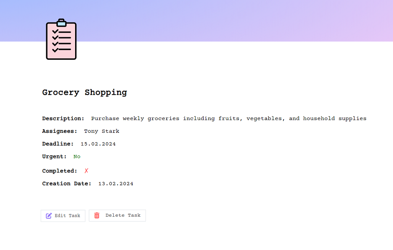

# TaskManager

# Task Manager Application

## Overview

This Task Manager application is a personal project designed to enhance my coding skills and create a practical tool for personal use. Developed in Java, it leverages Thymeleaf, Spring Framework, Gradle, and Java Persistence API (JPA) to provide a robust and user-friendly experience for managing daily tasks.

## Features

- **Task Management**: Users can create, view, update, and delete tasks

  

- **Task Details**: Each task can have a title, description, assignee, urgency, completion, due date, and assignees.

  

- **Assignee Management**: Add, edit, and delete assignees for each task.

  

- **Filtering and Sorting** (to be implemented): Tasks can be sorted by dates, urgency, completion status, and more.

## Technical Details

- **Language**: Java
- **Web Framework**: Spring
- **Template Engine**: Thymeleaf
- **Build Tool**: Gradle
- **Database Integration**: JPA
- **Database**: MySQL

## License

This project is open-sourced under the MIT license.
